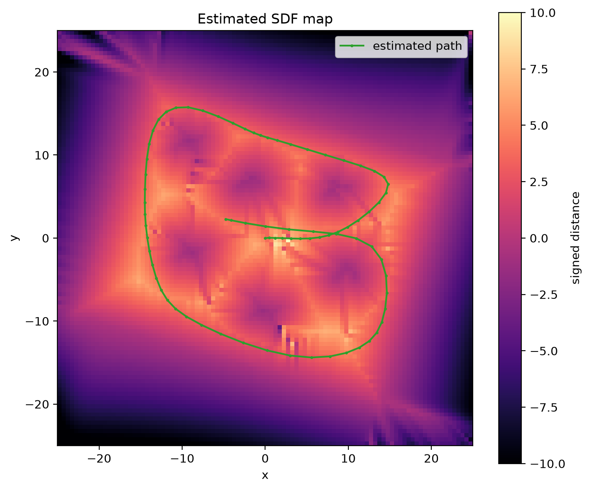
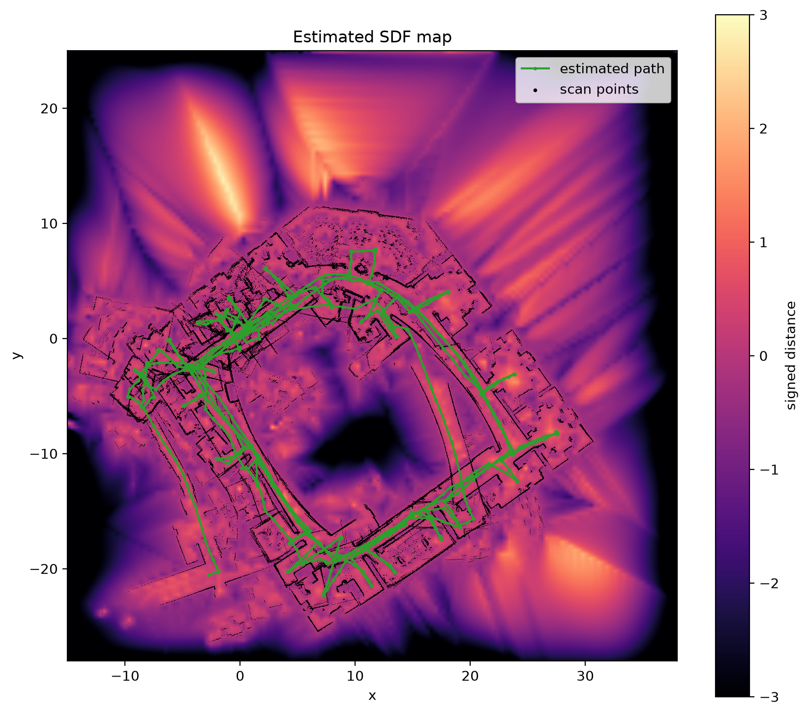

# sdf-slam

A 2D SLAM system that jointly optimizes sensor poses and a continuous signed
distance function (SDF) map in a single nonlinear least-squares problem.
Improved C++ reimplementation of the MInf dissertation *SDF SLAM* (Robin Jehn,
University of Edinburgh, 2026).



## How it works

The state vector holds every (active) SDF grid value plus the poses of all
scans (frame 0 fixed). Four residual types form one objective:

- **Scan**: the interpolated SDF at each transformed scan point must be zero.
- **Hallucination**: points sampled along each beam around the surface carry
  known signed distances, preventing the degenerate all-zero map.
- **Eikonal**: the SDF gradient projected onto the estimated surface normal
  must have unit magnitude.
- **Odometry**: relative pose measurements between consecutive frames.

A Levenberg-Marquardt solver exploits the Jacobian's sparsity (7 nonzeros per
point row) via sparse Cholesky. A Ceres backend solves the same problem for
comparison; `bench_solvers` measures both.

## Improvements over the dissertation implementation

- Parallel residual/Jacobian assembly; 100 batch iterations on the 76-scan
  simulated dataset run in ~9 s.
- Optional active-region state: only observed grid nodes are optimized.
- Three normal-estimation methods (`pca`, `hybrid`, `weighted`) for the
  Eikonal residual. The ablation on the noisy simulated dataset picked
  `weighted` as the default: 3x lower relative rotation error than the PCA
  baseline (DEC-0003).
- Analytic bilinear map gradients (consistent with the interpolation model),
  angle-wrapped odometry residuals, Jacobians verified against finite
  differences in the test suite.
- Lean dependencies: no PCL, no OpenCV.

## Build

Requires CMake ≥ 3.20, Ninja, Eigen, and Ceres (`brew install eigen
ceres-solver` / `apt install libeigen3-dev libceres-dev`). Everything else is
fetched at configure time.

```sh
make build          # configure + compile
make test           # unit + end-to-end tests
make check          # format check + build + tests + clang-tidy (CI gate)
make bench          # LM vs Ceres solver benchmark
```

## Run

```sh
./build/run_slam configs/simu_76_batch.yaml     # dissertation experiment 4.1.1
./build/run_slam configs/simu_76_noise.yaml     # experiment 4.1.3
./build/run_slam configs/intel_incremental.yaml # experiment 4.2.3 (slow)
```

Outputs land in `out/<run>/`: `poses_*.csv`, `map.txt`,
`scan_points_global.csv`, `metrics.json`.
Figures:

```sh
cd tools/viz
uv run plot_map.py ../../out/simu_76_batch
uv run plot_trajectory.py ../../out/simu_76_batch
```

`plot_map.py` renders the map's bilinear surface at 8 samples per grid cell
(`--upsample`) and overlays the scan points in black. The smooth rendering
evaluates the same interpolant the optimizer uses; the model's spatial
resolution stays capped by the node spacing.

Incremental runs with `snapshot_every: N` write per-increment map and pose
snapshots to `out/<run>/snapshots/`. `make_video.py` animates them (needs
ffmpeg):

```sh
cd tools/viz
uv run make_video.py ../../out/intel_fixed_domain --dataset ../../data/intel
```

## Results (simu_76, ground-truth odometry)

| Metric | This repo | Dissertation (table 4.2) |
| --- | --- | --- |
| Mean translation error | 0.022 | 0.022 |
| Mean rotation error (rad) | 0.00033 | 0.00037 |
| Mean rel. translation error | 0.0034 | 0.0031 |
| Mean rel. rotation error (rad) | 0.00015 | 0.00014 |

The smooth-gradient pose Jacobian (DEC-0007, on by default) closes the
earlier gap to the dissertation's numbers.

On the full 910-scan Intel dataset, `configs/intel_smooth_gradient.yaml`
(10 LM iterations per new scan, smooth-gradient recipe, DEC-0007) stays
globally consistent without loop closure and resolves the interior rooms.
Median revisit error (`tools/viz/revisit_consistency.py`): 0.065 m; the
original implementation's saved artifacts score 0.378 m on the one-lap
slice they cover, where this recipe scores 0.013 m. Runtime: 39 minutes on
an M-series laptop (the recipe needs the dense state; the active-region
config runs in 16 minutes at lower quality). Solver hot paths run on
threads whose results are bitwise equal to the serial code — the recipe is
chaotically sensitive, so optimizations must not change a single bit
(DEC-0008):

Because Intel has no ground truth and the NN revisit metric rewards
compressed estimates, runs are also scored against frozen ICP-verified
relative poses (`tools/viz/icp_relations.py`, `data/intel_relations_icp.csv`):
the flagship scores 0.057 m median translation error over 189 reference
pairs. The recipe transfers to finer grids by rule rather than re-tuning
(DEC-0009): `configs/intel_smooth_gradient_150.yaml` (0.36 m cells,
eikonal scaled by cell area) matches the flagship's ICP-relations score
(0.052-0.061 m over four runs) with a thinner error tail. Parameter
changes are gated by stability ensembles
(`tools/viz/stability_ensemble.py`), since single runs in this regime are
draws from a basin distribution.



## Solver benchmark (simu_10, 5 LM iterations, M-series laptop)

| Case | Time |
| --- | --- |
| Hand-rolled LM, dense map | 127 ms |
| Hand-rolled LM, active region | 52 ms |
| Ceres, dense map | 194 ms |
| Ceres, active region | 125 ms |

## Layout

- `src/core` — poses, PCD/dataset loading, SDF grid, normals, hallucinated points
- `src/problem` — residual math with analytic Jacobians, problem assembly
- `src/solvers` — hand-rolled LM and Ceres backends
- `src/pipeline` — YAML config, batch/incremental runner, metrics
- `docs/product` — PRD and decision records (DEC-NNNN, referenced from code)
- `data` — vendored simulated + Intel Research Lab datasets

## License

MIT
